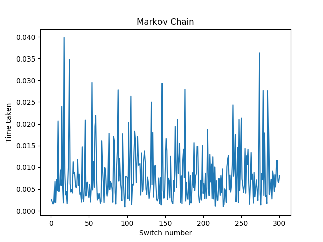
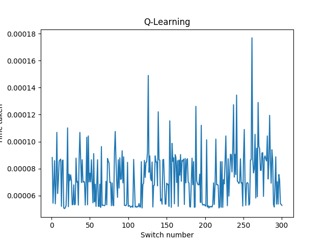

# Vermilion Solver
Python script to teach agents how to solve the [Vermilion City Gym puzzle](http://wiki.pokemonspeedruns.com/index.php/Trash_Cans) in the popular games [Pokémon Red and Blue](https://en.wikipedia.org/wiki/Pok%C3%A9mon_Red_and_Blue) using two basic deep learning algorithms. The algorithms used are listed below:
- [Markov Decision Process](https://en.wikipedia.org/wiki/Markov_decision_process)
- [Q-Learning](https://en.wikipedia.org/wiki/Q-learning)

## The Puzzle
In order to reach the Gym Leader, the player has to click two hidden switches in an array of trashcans. If the user finds the first switch, but guesses incorrectly the second switch, then the two switches will reset and change positions.

## Strategy
There is a method to narrow down the search, but it still involves guessing. There is a number of trashcans than can be the first one, marked as red in the picture below. The second trashcan will always be next to the first one and in some cases there is only one option to choose from, therefore the agent will always assign a higher reward to trashcans next to the first one if it finds the first switch.

## Results
We ran the program until the agent guesses the switches correctly 300 times, we expected the agent to take less time to find them as it progressed finding the swithces, but since the puzzle involves guessing it showed that even by using deep learning algorithms the agent could take a longer time to solve the puzzle if the switch was placed in a trashcan where the probability of finding a second switch was 25%.

|               MDP               |                   Q-Learning                   |
|               ---               |                   ----------                   |
|  |  |

---

For more information, you can look at the [report](./report.pdf).
